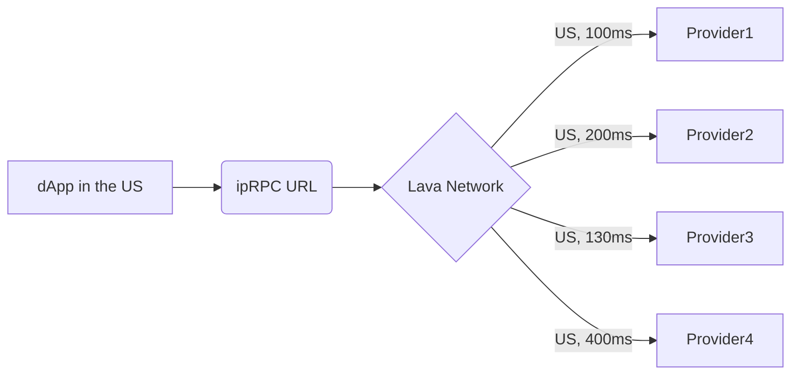

# Access Lava RPC

RPC is essential for interacting with blockchains — every interaction, such as trading, swapping, staking, and even checking the wallet balance, is an RPC request. Lava provides data consumers (AI agents, dApps, indexers, explorers, wallets, etc.) with an easy way to access fast and ultra-reliable RPC.

### Incentivized Public Endpoints

Lava works with various blockchains to establish [**Incentivized Public RPC (ipRPC) endpoints**](./iprpc.md). ipRPC endpoints are given unified URLs serviced by diverse providers within each chain's ecosystem. Providers are compensated by their respective ecosystems to offer services, while developers benefit from highly reliable endpoints unified under a single URL.

 

 

These endpoints are completely free and open to all consumers. Public incencitized endpoints provide data access to all supported chains at 3 req/s.

### Public Community Endpoints

[**Community endpoints**](./public-rpc.mdx) are RPC services offered by various community members and organizations. These endpoints provide free access to blockchain data, though availability and performance may vary as they are maintained by community members.

### Gateway

The [**Lava Gateway**](./gateway-endpoints.md), developed by the MagmaDevs team, is a simplified web interface that gives developers instant access to blockchain data. The Gateway uses the Lava Server Kit to provide a hosted access point for developers seeking RPC services through the Lava Network. 

This allows users to manage and configure Web3 APIs through intuitive controls directly from the browser. Through the Gateway, consumers gain an intuitive interface for API access, along with example calls for each supported chain.

Gateway enables data access to supported chains at 100 req/s.

### Increasing access rates
Developers that require higher data access rate than those provided by incentivized public endpoints and Gateway can get custom subscription plans that can support higher data access rates and specific customizations. If you are interested in purchasing subscription, hop on Gateway and reach out to the Lava team.
