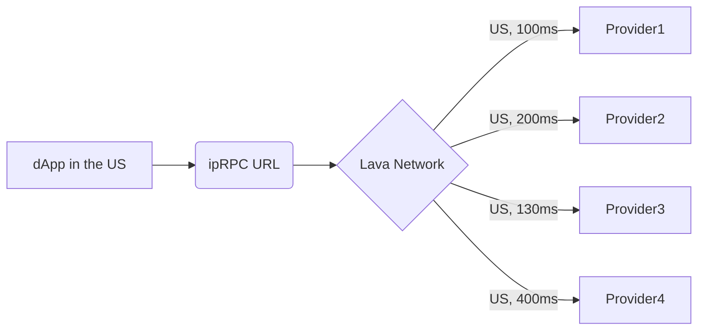

# Ways to access Lava RPC

## Incentivized Public Endpoints

Lava works with various blockchains to establish **Incentivized Public RPC (ipRPC) endpoints**. ipRPC endpoints are given unified URLs serviced by diverse providers within each chain's ecosystem. Providers are compensated by their respective ecosystems to offer services, while developers benefit from highly reliable endpoints unified under a single URL.

 

 

## Public Community Endpoints

Community endpoints are RPC services offered by various community members and organizations. These endpoints provide free access to blockchain data, though availability and performance may vary as they are maintained by different providers.

## Gateway

The **Lava Gateway**, developed by the Magma team, is a simplified web interface that gives developers instant access to blockchain data. The Gateway uses the Lava Server Kit to provide a hosted access point for developers seeking RPC services through the Lava Network.

This allows users to manage and configure Web3 APIs through intuitive controls directly from the browser. Through the Gateway, consumers gain an intuitive interface for API access, along with example calls for each supported chain.

