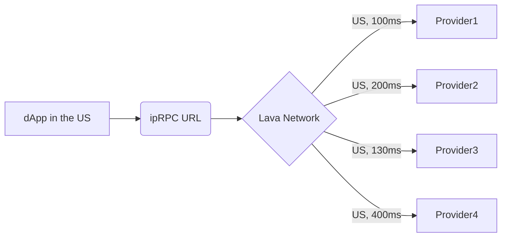

# 受激励的公共 RPC（ipRPC）

## 概览 🔎

Lava 与各种区块链合作，建立**激励公共 RPC (ipRPC)端点**。ipRPC 端点被赋予统一的 URL，由各链生态系统的不同提供商提供服务。提供商由各自的生态系统付费提供服务，开发人员则可从通过单个 URL 统一的高服务端点中获益。

 

 

## Agoric Endpoints 🌟

### Mainnet 🌐 `AGR`

| Service 🔌          | URL 🔗                                 |
|---------------------|----------------------------------------|
| 🟢  rest  | <https://agr.rest.lava.build> |
| 🟢  grpc  | <https://agr.grpc.lava.build> |
| 🟢  tendermintrpc | <https://agr.tendermint.lava.build> |

### Testnet 🧪 `AGRT`

| Service 🔌          | URL 🔗                                 |
|---------------------|----------------------------------------|
| 🟢  rest  | <https://agrt.rest.lava.build> |
| 🟢  grpc  | <https://agrt.grpc.lava.build> |
| 🟢  tendermintrpc | <https://agrt.tendermint.lava.build> |

 

## Axelar Endpoints 🌟

### Mainnet 🌐 `AXELAR`

| Service 🔌          | URL 🔗                                 |
|---------------------|----------------------------------------|
| 🟢 tendermint-rpc    | https://tm.axelar.lava.build            |
| 🟢 tendermint-rpc / websocket | wss://tm.axelar.lava.build/websocket |
| 🟢 rest              | https://rest.axelar.lava.build         |
| 🟢 grpc              | grpc.axelar.lava.build:443             |

### Testnet 🧪 `AXELART`

| Service 🔌                  | URL 🔗                                    |
|-----------------------------|-------------------------------------------|
| 🟢 tendermint-rpc            | https://tm.axelar-testnet.lava.build       |
| 🟢 tendermint-rpc / websocket | wss://tm.axelar-testnet.lava.build/websocket |
| 🟢 rest                      | https://rest.axelar-testnet.lava.build     |
| 🟢 grpc                      | grpc.axelar-testnet.lava.build:443        |

 

## Evmos Endpoints 🌟

### Mainnet 🌐 `EVMOS`

| Service 🔌          | URL 🔗                                 |
|---------------------|----------------------------------------|
| 🟢 tendermint-rpc    | https://tm.evmos.lava.build            |
| 🟢 tendermint-rpc / websocket | <wss://tm.evmos.lava.build/websocket> |
| 🟢 json-rpc          | https://evmos.lava.build               |
| 🟢 json-rpc / websocket | <wss://evmos.lava.build/websocket>     |
| 🟢 rest              | https://rest.evmos.lava.build          |
| 🟢 web-gRPC          | https://grpc.evmos.lava.build          |
| 🟢 grpc              | grpc.evmos.lava.build:443              |

### Testnet 🧪 `EVMOST`

| Service 🔌                  | URL 🔗                                    |
|-----------------------------|-------------------------------------------|
| 🟢 tendermint-rpc            | https://tm.evmos-testnet.lava.build       |
| 🟢 tendermint-rpc / websocket | <wss://tm.evmos-testnet.lava.build/websocket> |
| 🟢 json-rpc                  | https://evmos-testnet.lava.build          |
| 🟢 json-rpc / websocket      | <wss://evmos-testnet.lava.build/websocket>  |
| 🟢 rest                      | https://rest.evmos-testnet.lava.build     |
| 🟢 web-gRPC                  | https://grpc.evmos-testnet.lava.build     |
| 🟢 grpc                      | grpc.evmos-testnet.lava.build:443         |

 

## NEAR Endpoints 🌟

### Mainnet 🌐 `NEAR`

| Service 🔌          | URL 🔗                                 |
|---------------------|----------------------------------------|
| 🟢  json-rpc  | https://near.lava.build
 |

### Testnet 🧪 `NEART`

| Service 🔌          | URL 🔗                                 |
|---------------------|----------------------------------------|
| 🟢  json-rpc  | https://near-testnet.lava.build |

 

## Starknet Endpoints 🌟

### Mainnet 🌐 `STRK`

| Service 🔌          | URL 🔗                                 |
|---------------------|----------------------------------------|
| 🟢  json-rpc  | https://rpc.starknet.lava.build |

### Testnet 🧪 `STRKT`

| Service 🔌          | URL 🔗                                 |
|---------------------|----------------------------------------|
| 🟢  json-rpc  | https://rpc.starknet-testnet.lava.build |

