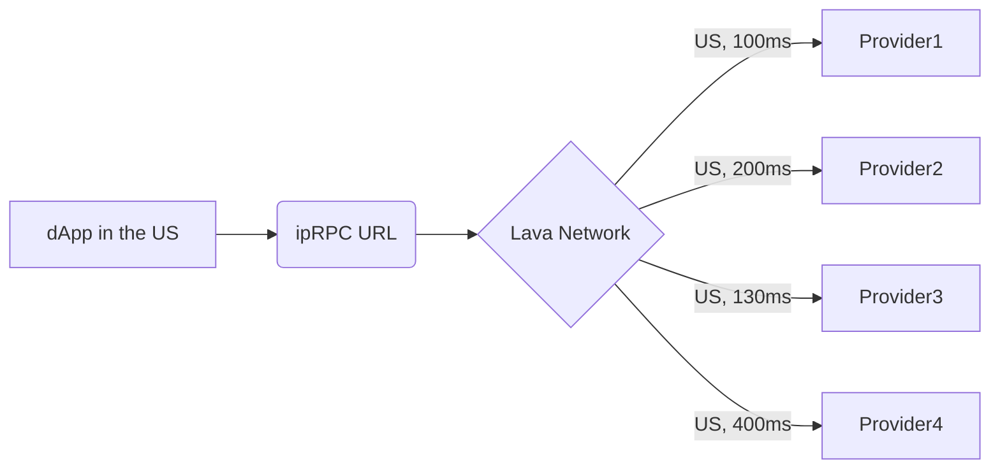

# Incentivized Public RPC (ipRPC) 

## Overview 🔎

Lava works with various blockchains to establish **Incentivized Public RPC (ipRPC) endpoints**. ipRPC endpoints are given unified URLs serviced by diverse providers of each chain's ecosystem. Providers are paid by those respective ecosystems to offer their services and developers benefit from the availability of highly-serviced endpoints unified through a single URL.

 

 

## Axelar Endpoints 🌟

### Mainnet 🌐 `AXELAR`

| Service 🔌          | URL 🔗                                 |
|---------------------|----------------------------------------|
| 🟢 tendermint-rpc    | https://tm.axelar.lava.build            |
| 🟢 tendermint-rpc / websocket | wss://tm.axelar.lava.build/websocket |
| 🟢 rest              | https://rest.axelar.lava.build         |
| 🟢 grpc              | grpc.axelar.lava.build:443             |

### Testnet 🧪 `AXELART`

| Service 🔌                  | URL 🔗                                    |
|-----------------------------|-------------------------------------------|
| 🟢 tendermint-rpc            | https://tm.axelar-testnet.lava.build       |
| 🟢 tendermint-rpc / websocket | wss://tm.axelar-testnet.lava.build/websocket |
| 🟢 rest                      | https://rest.axelar-testnet.lava.build     |
| 🟢 grpc                      | grpc.axelar-testnet.lava.build:443        |

 

## Evmos Endpoints 🌟

### Mainnet 🌐 `EVMOS`

| Service 🔌          | URL 🔗                                 |
|---------------------|----------------------------------------|
| 🟢 tendermint-rpc    | https://tm.evmos.lava.build            |
| 🟢 tendermint-rpc / websocket | <wss://tm.evmos.lava.build/websocket> |
| 🟢 json-rpc          | https://evmos.lava.build               |
| 🟢 json-rpc / websocket | <wss://evmos.lava.build/websocket>     |
| 🟢 rest              | https://rest.evmos.lava.build          |
| 🟢 web-gRPC          | https://grpc.evmos.lava.build          |
| 🟢 grpc              | grpc.evmos.lava.build:443              |

### Testnet 🧪 `EVMOST`

| Service 🔌                  | URL 🔗                                    |
|-----------------------------|-------------------------------------------|
| 🟢 tendermint-rpc            | https://tm.evmos-testnet.lava.build       |
| 🟢 tendermint-rpc / websocket | <wss://tm.evmos-testnet.lava.build/websocket> |
| 🟢 json-rpc                  | https://evmos-testnet.lava.build          |
| 🟢 json-rpc / websocket      | <wss://evmos-testnet.lava.build/websocket>  |
| 🟢 rest                      | https://rest.evmos-testnet.lava.build     |
| 🟢 web-gRPC                  | https://grpc.evmos-testnet.lava.build     |
| 🟢 grpc                      | grpc.evmos-testnet.lava.build:443         |

 

## NEAR Endpoints 🌟

### Mainnet 🌐 `NEAR`

| Service 🔌          | URL 🔗                                 |
|---------------------|----------------------------------------|
| 🟢  json-rpc  | https://near.lava.build
 |

### Testnet 🧪 `NEART`

| Service 🔌          | URL 🔗                                 |
|---------------------|----------------------------------------|
| 🟢  json-rpc  | https://near-testnet.lava.build |

 

## Starknet Endpoints 🌟

### Mainnet 🌐 `STRK`

| Service 🔌          | URL 🔗                                 |
|---------------------|----------------------------------------|
| 🟢  json-rpc  | https://rpc.starknet.lava.build |

### Testnet 🧪 `STRKT`

| Service 🔌          | URL 🔗                                 |
|---------------------|----------------------------------------|
| 🟢  json-rpc  | https://rpc.starknet-testnet.lava.build |

"we will add Lava endpoints soon"
