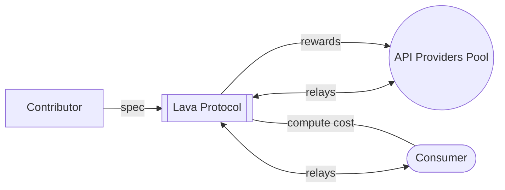

# Web3模块化数据访问

## Lava是什么？ 🌋

Lava是区块链的第一个模块化数据访问层。它引入了 [`specs`](/spec)：一种模块化原语，让贡献者无需权限即可向基础协议添加对新链和数据服务的支持。RPC是协议支持的第一个服务，但我们很快将通过与索引和API合作伙伴（例如 Subsquid）进行集成，为用户带来更多选择。

数据消费者向 Lava 的数据提供者（节点运营商）网络发送请求，后者加入 Lava 以满足数据需求。Lava 围绕任何区块链数据服务创建动态、可扩展的市场。该协议还围绕服务质量（速度、运行时间和数据准确性）创建了加密经济保证。

通过利用模块化架构和节点运营商的对等网络，Lava创建了一个访问多链世界的统一平台。

### 它是如何工作的? 🔩

**开发者和数据消费者:**
有了Lava，数据消费者可以轻松、快速和可靠地访问30多个链。该协议激励提供商提供高性能的服务，并在算法上将消费者与可用的最佳节点配对。

**数据提供者（RPC 节点运行器、索引器等）：**
供应商加入Lava以触达更多开发者并将其现有基础设施变现。我们在Lava测试网上还有250多个提供商，包括像Blockdaemon这样的大型提供商。Lava还运行名为激励公共RPC的程序。在这些项目中，Evmos、Axelar、NEAR 等链向节点运营商支付提供高服务质量 RPC 的费用。

### 为什么选择Lava？❣️

Lava 提供了即用的多链 RPC：

1. **服务质量 -** 消费者根据响应时间、可用性和数据时效性监控和评价提供者。提供者在请求奖励时需要附加他们的QoS（服务质量）分数，并根据分数获得相应奖励。

2. **数据的可靠性 -** 提供者受到欺诈和故障检测的审查，网络使用统计推断和可验证的随机选择来比较多个提供者的响应。如果检测到冲突，网络将利用大多数诚实的提供者来确定谁错了，并对违规者进行惩罚。

3. **隐私与匿名 -** 中继器在不断变化的顶级供应商名单之间随机分配，因此消费者不太可能在相当长的一段时间内获得同一供应商的服务。消费者与提供商之间的通信是直接进行的，身份与 Lava 钱包没有关联。

4. **可扩展性 -** Lava 的方方面面都考虑到了可扩展性。单步奖励系统、聚合、提供商与应用程序之间的直接通信以及质押激励措施旨在通过减少网络不必要的压力来提高效率。

5. **去中心化访问 -** 我们鼓励用户以完全去中心化的方式访问我们的网络。 我们网络上的所有中继都是点对点（P2P）进行的。

6. **开源 -** Lava 致力于开源和模块化。开发人员可以研究链的代码和实施的任何规范。
