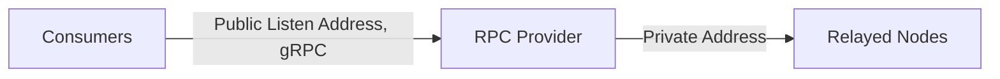

import RoadmapItem from '@site/src/components/RoadmapItem';

# Be a Provider
Welcome to the Lava network's provider introduction. In this page, you'll learn about the role of providers in the Lava network, as well as the necessary steps to get started as one.

:::info want to be a testnet Provider? ✍️
To get the initial testnet LAVA stake, read the [Provider Incubation program details](https://lavanet.notion.site/Lava-Testnet-Providers-Incubation-Program-2d45589294b84976843fd55569f8be87) 📖
:::

## **Providers in Lava's Protocol**

Providers are the backbone of the Lava network, servicing relay requests by staking on the network and operating RPC nodes on Relay Chains queried by Consumers (e.g., Cosmos, Ethereum, Osmosis, Polygon, etc.). In return, they earn fees in the form of LAVA tokens from the Consumers for servicing these requests.



### **Becoming a Provider**

To join the Lava network as a provider, follow these steps:

1. Ensure your Relay Chain RPC Nodes are operational and meet the required specifications.
2. Stake LAVA and run Lava’s lightweight Provider process, as detailed in our **[Provider Setup](docs/provider/provider-setup.md)** guide.

:::info Want to learn more?
Learn more by reading our [litepaper](https://lavanet.xyz)
:::

### **Provider Parameters**

When staking as a provider, there are four main parameters used in the transaction:

1. **Stake**: The amount of LAVA to stake for the service.
2. **Geolocation**: The location of the provider's nodes.
3. **ChainID**: The identifier of the target blockchain network, such as Cosmos Mainnet, Ethereum Ropsten, etc.
4. **Endpoints**: A list of endpoints, each defining an address, geolocation and an API interface such as REST, JSON-RPC, etc.

Providers need to stake separately for each supported spec. For example, if you support both Cosmos and Ethereum, you will need two separate stakes. Once your request is verified and included in the chain state, you'll be included in the Pairing List starting from the next Epoch and can begin servicing consumer requests through your nodes.

### **Supported APIs and Chain Specifications**

Lava's protocol expands its support to new RPCs by adding Specifications ("specs") via governance. Each spec describes the schema needed for the RPC and aligns the different actors on the provided interface.

### Querying Available APIs and Chains {#chains}

To obtain a list of available APIs and chains, [query all chain specs](https://https://public-rpc-testnet2.lavanet.xyz/rest/lavanet/lava/spec/show_all_chains) or use the following CLI commands for detailed list:

```bash
lavad q spec list-spec --node https://public-rpc-testnet2.lavanet.xyz:443/rpc/
```

## Next step: Setup a Provider

When you're ready, join **as a provider**:
[<RoadmapItem icon="🧑‍⚖️" title="Power as a Provider" description="Provide node data, earn rewards"/>](/provider-setup)
