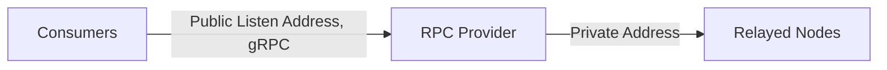

import RoadmapItem from '@site/src/components/RoadmapItem';

# 成为提供商
欢迎来到 Lava 网络的提供商介绍。在本页中，您将了解提供者在 Lava 网络中的角色，以及开始作为一个提供者开始的必要步骤。

:::info 想成为测试网提供商？ ✍️
要获得初始测试网 LAVA 质押，请阅读 [提供商孵化计划详细信息](https://lavanet.notion.site/Lava-Testnet-Providers-Incubation-Program-2d45589294b84976843fd55569f8be87) 📖
:::

## **Lava协议中的提供商**

提供者是 Lava 网络的骨干，通过在网络上质押和在消费者查询的中继链（例如 Cosmos、以太坊、Osmosis、Polygon 等）上运行 RPC 节点来为中继请求提供服务。作为回报，他们以 LAVA 代币的形式从消费者那里赚取费用，以服务这些请求。



### **成为供应商**

要以提供商身份加入 Lava 网络，请按照下列步骤操作：

1. 确保您的中继链 RPC 节点正常运行并满足所需的规范。
2. 质押 LAVA 并运行 Lava 的轻量级 Provider 流程，详见我们的 Provider 设置指南。 **[Provider Setup](docs/provider/provider-setup.md)** guide.

:::info 想了解更多？
通过阅读我们的[白皮书](https://lavanet.xyz)了解更多信息 。
:::

### **提供商参数**

当作为提供商进行质押时，交易中使用了四个主要参数：

1. **Stake**: 为服务质押的 LAVA 数量。
2. **Geolocation**: 提供程序节点的位置。（请注意， `0` 仅通过政策/治理提案分配）
```javascript    
    GLS = 0; // Global-strict
    USC = 1; // US-Center
    EU = 2; // Europe
    USE = 4; // US-East
    USW = 8; // US-West
    AF = 16; // Africa
    AS = 32; // Asia
    AU = 64;  // (Australia, includes NZ)
    GL = 65535; // Global
```
3. **ChainID**: 目标区块链网络的标识符，如Cosmos Mainnet、Ethereum Ropsten等。
4. **Endpoints**: 端点列表，每个端点定义一个地址和地理位置

提供商需要为每个支持的规范单独质押。例如，如果您同时支持 Cosmos 和以太坊，您将需要两个单独的质押。一旦您的请求被验证并包含在链状态中，您将从下一个 Epoch 开始包含在配对列表中，并且可以开始通过您的节点为消费者请求提供服务。

### **支持的 API 和链规范**

Lava 的协议通过治理添加规范（"specs"）来扩展其对新 RPC 的支持。每个规范都描述了 RPC 所需的架构，并对齐了所提供接口上的不同参与者。

要获取特定链的信息，请运行以下命令，替换 `SPEC-ID`：

```bash
curl -X 'GET' \
  'https://rest-public-rpc.lavanet.xyz/lavanet/lava/spec/show_chain_info/SPEC-ID' \
  -H 'accept: application/json'
```

### 查询可用的 API 和链 {#chains}

要获取可用 API 和链的列表，请使用 [query all chain specs](https://public-rpc-testnet2.lavanet.xyz/rest/lavanet/lava/spec/show_all_chains) 或使用以下 CLI 命令：


```bash
curl -X 'GET' \
  'https://public-rpc-testnet2.lavanet.xyz/rest/lavanet/lava/spec/show_all_chains' \
  -H 'accept: application/json' | jq
```

或者
```bash
lavap q spec list-spec --node https://public-rpc-testnet2.lavanet.xyz:443/rpc/
```


## 下一步：设置提供程序

准备就绪后，以**提供商**身份加入：
[<RoadmapItem icon="🧑‍⚖️" title="Power as a Provider" description="Provide node data, earn rewards"/>](/provider-setup)
