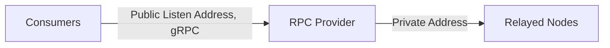

import RoadmapItem from '@site/src/components/RoadmapItem';

# Become a Provider
Welcome to the Lava network's provider introduction. In this page, you'll learn about the role of providers in the Lava network, as well as the necessary steps to get started as one.

:::info want to be a testnet Provider? ✍️
To get the initial testnet LAVA stake, read the [Provider Incubation program details](https://lavanet.notion.site/Lava-Testnet-Providers-Incubation-Program-2d45589294b84976843fd55569f8be87) 📖
:::

## **Providers in Lava's Protocol**

Providers are the backbone of the Lava network, servicing relay requests by staking on the network and operating RPC nodes on Relay Chains queried by Consumers (e.g., Cosmos, Ethereum, Osmosis, Polygon, etc.). In return, they earn fees in the form of LAVA tokens from the Consumers for servicing these requests.



### **Becoming a Provider**

To join the Lava network as a provider, follow these steps:

1. Ensure your Relay Chain RPC Nodes are operational and meet the required specifications.
2. Stake LAVA and run Lava’s lightweight Provider process, as detailed in our **[Provider Setup](docs/provider/provider-setup.md)** guide.

:::info Want to learn more?
Learn more by reading our [litepaper](https://lavanet.xyz)
:::

### **Provider Parameters**

When staking as a provider, there are four main parameters used in the transaction:

1. **Stake**: The amount of LAVA to stake for the service.
2. **Geolocation**: The location of the provider's nodes. (Note that `0` is *only* assigned via policy/gov proposal)
```javascript    
    GLS = 0; // Global-strict
    USC = 1; // US-Center
    EU = 2; // Europe
    USE = 4; // US-East
    USW = 8; // US-West
    AF = 16; // Africa
    AS = 32; // Asia
    AU = 64;  // (Australia, includes NZ)
    GL = 65535; // Global
```
3. **ChainID**: The identifier of the target blockchain network, such as Cosmos Mainnet, Ethereum Ropsten, etc.
4. **Endpoints**: A list of endpoints, each defining an address and geolocation.
5. **Vault address**: An additional address that can be used as a secure location for holding funds.

Providers need to stake separately for each supported spec. For example, if you support both Cosmos and Ethereum, you will need two separate stakes. Once your request is verified and included in the chain state, you'll be included in the Pairing List starting from the next Epoch and can begin servicing consumer requests through your nodes.

### **Vault Address**

Usually, the provider entity has a single lava address. This address is utilized for operating the provider process, such as participating in the pairing mechanism, and for aggregating rewards from relay payments or IPRPC.

For enhanced security, users can optionally create a vault address. This address holds the provider's funds and rewards, while a separate address operates the provider. The rationale behind this is to allow users to use two private keys: one for provider operation and another for rewards aggregation and funds holdings. This setup enables users to store their vault private key on a machine separate from the one running the provider process. Consequently, if the machine operating the provider, which publicly shares its endpoints, were to be compromised, the users' wallet would remain secure.

A vault address can be specified while staking a provider. When staking, use the `--provider` flag to define the provider's operational ("normal") address. The `--from` flag address is then used as the vault address.

Since the vault address holds the provider's funds, it is the only one that can perform stake-related transactions. In simpler terms, the vault address can execute all transactions, while the operational address can carry out all transactions except for the following: `stake-provider`, `unstake-provider`, `claim-rewards`, and `modify-provider`. The latter cannot change certain provider traits, such as `stake`, `delegation-commission`, and `delegate-limit`.

### **Supported APIs and Chain Specifications**

Lava's protocol expands its support to new RPCs by adding Specifications ("specs") via governance. Each spec describes the schema needed for the RPC and aligns the different actors on the provided interface.

To obtain information on a specific chain, run the following command, replacing `SPEC-ID`:

```bash
curl -X 'GET' \
  'https://rest-public-rpc.lavanet.xyz/lavanet/lava/spec/show_chain_info/SPEC-ID' \
  -H 'accept: application/json'
```

### Querying Available APIs and Chains {#chains}

:::caution
Here and below ensure that you replace `{PUBLIC_RPC}` with the correct [endpoint](/public-rpc).
:::

To obtain a list of available **testnet-2** APIs and chains, [query all chain specs](https://public-rpc-testnet2.lavanet.xyz/rest/lavanet/lava/spec/show_all_chains) or use the following CLI commands for a detailed list:


```bash
curl -X 'GET' \
  '{PUBLIC_RPC}/rest/lavanet/lava/spec/show_all_chains' \
  -H 'accept: application/json' | jq
```

Alternatively,
```bash
lavap q spec list-spec --node {PUBLIC_RPC}
```


## Next step: Setup a Provider

When you're ready, join **as a provider**:
[<RoadmapItem icon="🧑‍⚖️" title="Power as a Provider" description="Provide node data, earn rewards"/>](/provider-setup)
